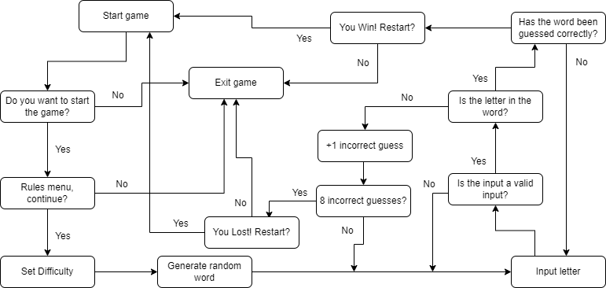
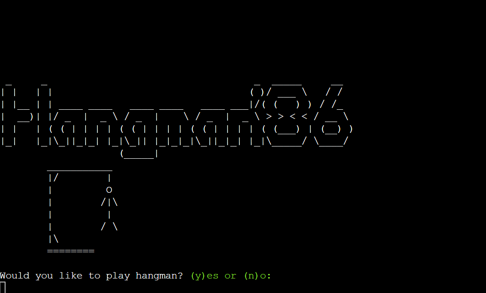
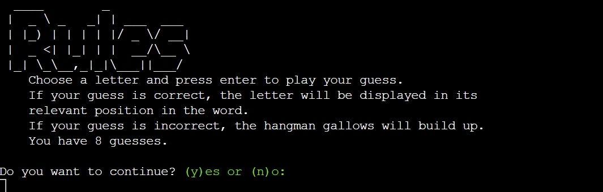
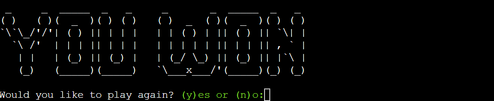

# **Hangman'86**
Hangman'86 is a Python terminal game in which players can try to guess a randomly generated word by inputting letters, this runs on the Code Institute mock terminal on Heroku. The game is over when the player either guesses the word correctly or the maximum number of incorrect guesses has been reached and the hangman gallows image is completed. The target audience is developers working in the IDE who enjoy playing straight forward games in their downtime or fellow beginner coders looking for inspiration for their next challenge. 

[Hangman'86](https://hangman-86.herokuapp.com/) - The live site can be viewed here. 

 

## **Table of Contents**
 * [**How to Play**](#how-to-play)
 * [**Planning Stage**](#planning-stage)
 * [**Features**](#features)
 * [**Testing**](#testing)
 * [**Technology Used**](#technology-used)
 * [**Bugs**](#bugs)
 * [**Validators**](#validators)
 * [**Deployment**](#deployment)
 * [**Credits**](#credits)

## **How to Play**
The game starts by prompting players to select a difficulty level which generates a random word of 4, 6 or 8 letters depending on the level chosen. Once the level has been selected the game initialises and players are prompted to input a letter in the terminal and press enter to play their guess. The goal of the game is to guess the hidden word, represented by _ _ _ _ relevant to the difficulty level chosen. Level 1 generates a 4 letter word, Level 2 a 6 letter word and Level 3 an 8 letter word. 
An error message is displayed if a player enters an incorrect command and is asked to resubmit a new guess. If the letter guessed is correct, the _ is replaced by the chosen letter in its relevant position in the word until all the letters are revealed and the game is over. If the letter guessed is incorrect a piece of the Hangman gallows is added to the terminal, players have a maximum of 8 incorrect guesses before the gallows is completed and the game is over.

## **Planning Stage**

### **User Experience UX**
To build a terminal version of Hangman for a developer to use in an IDE environment whilst taking a break from coding.
 * As a user, I want the game to be easy and fun to play.
 * As a user, I want clearly readable instructions on how the game works.
 * As a user, I want the game to provide a level of challenge without being too difficult.

### **Flowchart**
To help me plan how the game would function I drew out a basic flowchart which detailed each step of the development process I needed to take. This was a helpful guide when developing the game as it allowed me a structure to follow to acehieve my end result.
  * When and what inputs would be needed from the user?
  * What will happen when a user enters an invalid input?
  * How would the game respond when a user enters an incorrect guess?
  * How much interaction does the user have with the game environment?
  * Are there any outcomes that would cause the game loop to break unintentionally?

 ## **Features**

 ### **Existing Features**
* Game Menu
  * The user can select to start thengame to progress to rules menu or exit the game. This gives the user the chance to easily exit the game without having to play through until game over or closing the game completely.

* Rules Menu
  * The rules menu details to the user how the game is played, the user can then choose whether to progress to the set difficulty menu or exit the game.

* Set Difficulty
  * This is the final menu before the gameplay starts and allows the user to select the length of the word they wish to guess: 
    * Level 1 = 4 letter word
    * Level 2 = 6 letter word
    * Level 3 = 8 letter word

 * Random word generations
   * A function randomly generates a word from a list of 1382 words ranging from 4, 6 and 8 letters.

* Incorrect guesses with graphical representation
   * The user has 8 incorrect guesses before it is game over.
   * This is visible during gameplay allowing the user to fully understand the game progress.
   * The hangman gallows is built incrementally with each incorrect guess which means the user can visualise each step taken to build the gallows.

* Win and Lose screens
 * A graphic is displayed to declare the if the user has won or lost the game. 
 * Users can choose whether to restart the game or exit the game. Restarting the game takes the user back to the main menu as to allow another chance to read the instructions if required and select a new difficulty level.

* Invalid inputs
  * For all user inputs, checks are run to ensure there are no invalid inputs submitted. This means any guess that is a symbol, number or more than 1 letter will not be registered as a guess and will prompt the user to guess again.
  * Invalid input notifications have been added to all areas of the game that require a specific user input as to ensure a positive user experience.

* Colour Pallette
  * Provides an easier, more user friendly experience as input prompts are highlighted for better visibility and error messages are more recogniseable.
  * Green has been selected for user input prompts and correct guess messages.
  * Red has been selected for invalid input message alerts and incorrect guess messages.

### **Features Left to Implement**
* Add a scoring system and leaderboard so players can keep track of their winning streaks.
* Add a countdown timer which varies depending on the difficulty level selected, the harder the level the shorter the countdown timer.
* Allow players to guess a whole word if they think they know the answer, if guessed incorrectly the player loses despite number of guesses that are left.

## **Testing**

#### **Python standards Testing** 
  * Implementation - Standards testing was conducted via the PEP8 Linter (http://pep8online.com/)
  * Test - To carry out this test I copied my code into the PEP8 Linter and clicked 'Check code'. 
  * Result - A number of formatting errors were identified which, although, did not effect the functionality of my code these errors did not conform Python best practice standards. Once these errors were identified I set about making the appropriate changes.
  * Verdict - With the errors in my code format corrected I ran my code back through the PEP8 Linter and no further errors were highlighted. This test was passed.
  
#### **Invalid input Testing**
  * Implementation - Invalid input testing was conducted by myself in the local Code Institute terminal using the python3 run.py server to run my code.
  * Test - To carry out this test I used a wide variety of invalid inputs on each user input prompt.
  * Result - A small number of invalid input errors were identified which were noted as fixed bugs.
  * Verdict - With a small number of changes to my code this test was passed.

#### **Gameplay Functionality Testing**
  * Implementation - For this test I deployed my site on Heroku (see Deployment steps below).
  * Test - This test was carried out by my friends, family and select peers. Each individual was instructed to play the game with the intention to 'break' the game and feedback their thoughts on the games functionality.
  * Result - After vigorous testing there were no errors identified with the game functionality. Each user provided positive feedback on the rules of the game and the ease of play.
  * Verdict - This test was passed successfully.
  
## **Technology Used**
* Languages
  * Python
* Libraries
  * randint to select a random word.
* Other
  * answers.txt - File containing a list of randomly selected 4,6 and 8 letter words, sourced from (http://www.desiquintans.com/nounlist)

## **Bugs**

### **Fixed Bugs**
* Bug - Set difficulty menu looping once after initial level selection.
  * Fix - Removed unnecessary level_select = set_difficulty() function call.
* Bug - Gameplay starting when user input 'n' to exit game on Rules menu prompt.
  * Fix - Exit() added to if statement in the rules() function.
* Bug - user_input print statement not printing to terminal.
  * Fix - Removed unecessary _ = system('clear') from while loop.
* Bug - Restart function accepting any letter input for exit game.
  * Fix - Extended if else statement to if elif else for stricter user input validation.
* Bug - Restart game y input starting gameplay instead of taking 
user to main menu.
  * Fix - Added main(False) to restart_game() y input code.
* Bug - Goodbye message not appearing when user inputs n at restart game 
prompt.
  * Fix - missing print in restart_game().
* Bug - 'None' displaying in terminal under You Won or You Lost message when
called.
  * Fix - Change print() to return() on You Won and You Lost function.

### **Unfixed Bugs**
* No bugs currently identified.

## **Validators**
* PEP8
  * No errors were returned from (http://pep8online.com/).

## **Deployment**
The project was deployed using Code Institutes mock terminal for Heroku. 

* Steps to deploy:
  * Fork or clone this repository.
  * Create a new Heroku app by selecting 'New' and then 'Create new app'.
  * Give the app a name and follow the instructions to continue.
  * Open the Heroku settings and add two buildpacks in the order as follows:
    1. heroku/python
    2. heroku/nodejs
  * Still in the settings, create a Config Var called PORT, set this to 8000.
  * If you have credentials you must enter another Config Var called CREDS
  and paste in the contents of the JSON file.
  * Click 'Deploy' and choose your preferred deployment method and enter your 
  repository name to search.
  * Click 'connect' on your repository when it is displayed.
  * Your site will now be deployed on Heroku.

* Steps to deploy locally:
  * Clone this repository.
  * Install python on the local machine.
  * Navigate to the run.py folder inside the terminal.
  * Enter the command 'python3 run.py' and press enter.

## **Credits**
 * Code Institute for the mock deployment terminal. - [Code Institute](https://codeinstitute.net/)
 * Desi Quintans for the list of random english words as a downloadable file. - [Random Word Generator](http://www.desiquintans.com/nounlist)
 * YouTube channel StudentEngineer for the inspiration on how to build a hangman game in Python. However, as much as I have introduced my own style to the project, there may be instances where some of the code is similar. - [Python Hang Man tutorial](https://www.youtube.com/watch?v=TWLD2OKmSCQ)
* Patorjk for the word art used in the game menu, rules, gameover and you won/lost screens. - [ASCII Art Generator](https://patorjk.com/software/taag/#p=display&f=Nancyj-Underlined&t=Hello%20there)
* GO Colors for the color pallette. - [GO colors](https://pkg.go.dev/github.com/whitedevops/colors)

 ### **Acknowledgments**
* Richard Wells (https://github.com/D0nni387) - Code Institute mentor, without his patience and support I would not have been able to complete my project to a standard that I am happy with